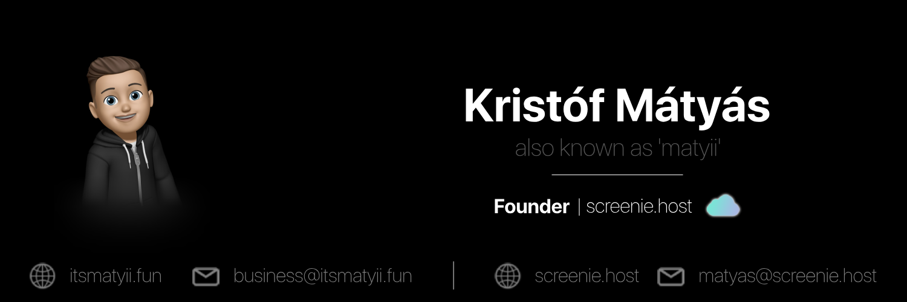

# hi there 🪐

My name is Kristóf Mátyás, and I’m a 20-year-old working as a full-time IT technician with a passion for all things tech.

I specialize in system administration and networking, though I'm always open to new challenges. I’ve worked on projects with FiveM, GitLab, UniFi, and more, and I’ve really enjoyed learning and collaborating on them.

For business enquiries, don’t hesitate to contact me via [e-mail](mailto:business@itsmatyii.fun).